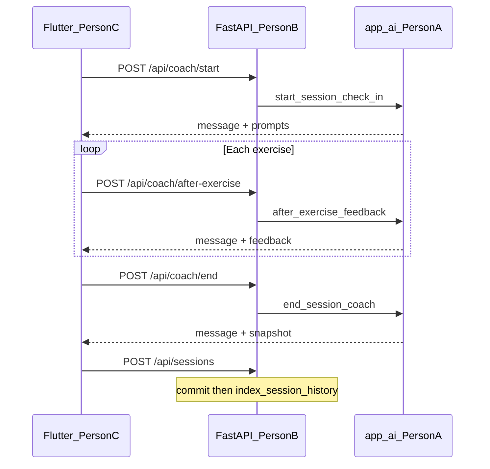

# Backend API Layer — Technical Documentation

**Project:** AI Fitness Coach  
**Scope:** FastAPI HTTP surface, auth, persistence, Alembic ownership, and AI orchestration  
**Package:** `backend/app/` (routers, schemas, models, core, db) — excluding `backend/app/ai/`  
**Status:** Person B deliverables complete  
**Document version:** 1.0  
**Last updated:** 2026-07-24

---

## 1. Executive summary

AI Fitness Coach is a **full digital coach**: learn the user, propose training, guide the workout, record what happened, and adapt the next session. Person A delivers that intelligence as **Python services**. Person B turns them into a **secure, owner-scoped HTTP API** that Flutter (Person C) can call.

This document describes the **backend API / data layer**: JWT auth, profile and program/session CRUD, AI-backed generate / suggest-next / live-coach routes, migration ownership, and how session saves feed personal history memory.

**What was delivered**

| Capability | Purpose |
|------------|---------|
| Auth & identity | Register / login, bcrypt passwords, JWT Bearer access |
| Profile API | Read and partial-update fitness profile (JWT-scoped) |
| Programs & sessions | Persist plans and completed workouts with ownership checks |
| AI program routes | `generate` and `suggest-next` → validate → persist under JWT user |
| Live coach routes | Start / after-exercise / mid-session / end as text-in / text-out HTTP |
| History wiring | After `POST /api/sessions`, best-effort `index_session_history` |
| Migrations | Own/apply Alembic chain (users → programs → AI tables → profile field) |
| Contracts & tests | Mobile-facing `api-contracts.md` + pytest coverage for B routes |

**Companion for request/response detail:** [`docs/api-contracts.md`](api-contracts.md) (Person C primary reference).  
**Companion for AI internals:** [`docs/AI_COACHING_LAYER.md`](AI_COACHING_LAYER.md) (Person A).

---

## 2. Product vision (API role)

### 2.1 Where the API sits in the product

| Phase | HTTP responsibility |
|-------|---------------------|
| Before training | Auth, profile PATCH, `POST /api/programs/generate` or `suggest-next`, list/get programs |
| During training | Live coach turns (`/api/coach/*`) — structured messages + UI prompts; no auto-save mid-workout |
| After training | `POST /api/coach/end` → client maps snapshot → `POST /api/sessions` (indexes history) |
| Over time | `POST /api/programs/suggest-next` uses indexed personal history |

### 2.2 Client and stack

| Layer | Technology |
|-------|------------|
| Mobile client (Person C) | Flutter (planned) — consumes this HTTP API |
| API (Person B) | FastAPI (Python 3.12), Pydantic schemas, SQLAlchemy async |
| AI services (Person A) | `backend/app/ai/` — called from routers, not exposed as routes inside `app/ai/` |
| Database | PostgreSQL 16 + pgvector |
| Orchestration | Docker Compose (`api`, `db`); `alembic upgrade head` on API start |

---

## 3. Team responsibilities

| Role | Ownership |
|------|-----------|
| **Person A (AI / RAG)** | `backend/app/ai/`, AI-related model schemas, ingest, retrieval, generation, live coach, smoke scripts |
| **Person B (API / data)** | Routers, auth, schemas for HTTP, persistence, Alembic apply/review, wiring AI calls from routes, API docs & route tests |
| **Person C (mobile)** | Flutter UI, optional voice STT/TTS wrapping the same text APIs |

**Boundary rules**

1. **No FastAPI routes inside `app/ai/`.** Routers live under `app/routers/` and call AI functions.  
2. **JWT user is source of truth for ownership.** Never trust `user_id` from the client body for persistence.  
3. **Coach routes are AI-only.** Persistence of finished workouts is `POST /api/sessions` only.  
4. **Voice stays on the client.** API payloads are text (and structured scales); STT/TTS is Person C.

---

## 4. Starting point (foundation)

Before AI orchestration, the backend already provided (or was extended to provide):

- User registration / login (JWT)
- Fitness profiles
- Programs with ordered exercises
- Sessions linked to programs (`program_id`)
- Session feedback fields (feeling, fatigue, difficulty, skipped, notes)

Person B’s completion work **orchestrates** Person A’s services on top of that foundation and exposes a complete mobile-ready contract.

---

## 5. Architecture overview

```text
┌─────────────────────┐
│  Flutter (Person C) │  HTTP + Bearer JWT (+ optional voice→text)
└──────────┬──────────┘
           │
┌──────────▼──────────────────────────────────────────┐
│ FastAPI — Person B                                  │
│  auth · users · programs · sessions · coach         │
│  JWT deps · Pydantic I/O · ownership checks         │
└──────────┬───────────────────────────┬──────────────┘
           │ Python await              │ SQLAlchemy async
           ▼                           ▼
┌──────────────────────┐      ┌──────────────────────┐
│ app/ai/ (Person A)   │      │ PostgreSQL + pgvector│
│ generate / suggest   │      │ users, profiles      │
│ live_coach / history │      │ programs, sessions   │
│ retrieval / catalog  │      │ knowledge / history  │
└──────────────────────┘      └──────────────────────┘
```

### 5.1 Design principles

1. **Owner-scoped reads/writes** — list endpoints filter by JWT user; get-by-id returns `403` if the row exists but is not owned.  
2. **Profile completeness for AI** — generate / suggest-next / coach require required profile fields; incomplete → `400 Incomplete profile`.  
3. **Validate AI before persist** — program AI output is validated as `ProgramCreate` before commit; invalid → `502`, no partial write.  
4. **Best-effort history indexing** — session save commits first; indexing failure is logged and does not roll back the session.  
5. **Stable HTTP contracts** — detailed shapes live in `api-contracts.md`; OpenAPI at `/docs` stays in sync with routers.

---

## 6. Delivery milestones (what we implemented)

### Milestone 1 — Auth and identity

**What:** Register, login, JWT dependency.  
**Why:** Every coaching and CRUD route must be attributable to one user.  
**How:**

- `routers/auth.py` — `POST /api/register`, `POST /api/login`  
- `core/security.py` — password hashing  
- `core/deps.py` — `get_current_user` via `OAuth2PasswordBearer` (`tokenUrl=/api/login`)

### Milestone 2 — Profile and domain CRUD

**What:** Profile get/patch; program and session list/get/create with ownership.  
**Why:** Mobile needs to store plans and completed work before and after AI.  
**How:**

- `routers/users.py` — `GET` / `PATCH /api/me/profile`  
- `routers/programs.py` — create, list mine, get by id, list sessions for a program  
- `routers/sessions.py` — create, list mine, get by id  
- Alembic: programs/sessions, `program_id` on sessions

### Milestone 3 — AI program generation & suggest-next

**What:** HTTP wrappers that load DB profile → call AI → persist under JWT user.  
**Why:** Person C never talks to Groq directly; B owns orchestration and storage.  
**How:**

| Route | AI call | Persist |
|-------|---------|---------|
| `POST /api/programs/generate` | `generate_program` | Yes → `ProgramResponse` `201` |
| `POST /api/programs/suggest-next` | `suggest_next_program` | Yes → program + `rationale` + `adaptations` |

Profile fields for AI come from the database only (not from a client-supplied profile blob). Optional `start_date` may be sent in the body.

### Milestone 4 — Session save + history indexing

**What:** `POST /api/sessions` validates optional `program_id` / exercise names, saves session, then indexes.  
**Why:** Suggest-next and continuity need `user_history_chunks`.  
**How:** After successful commit, best-effort `index_session_history(...)`. Indexing errors do not undo the saved session.

### Milestone 5 — Live coach HTTP surface

**What:** Four JWT-protected coach turns mirroring Person A’s `live_coach` functions.  
**Why:** In-session coaching is a product differentiator; Flutter needs stable endpoints + prompt schemas.  
**How (`routers/coach.py`):**

| Route | AI function | Persists? |
|-------|-------------|-----------|
| `POST /api/coach/start` | `start_session_check_in` | No |
| `POST /api/coach/after-exercise` | `after_exercise_feedback` | No |
| `POST /api/coach/mid-session` | `mid_session_coach` | No |
| `POST /api/coach/end` | `end_session_coach` | No — returns `snapshot` for client → `POST /api/sessions` |

Optional `program_id` on start / after-exercise loads an **owned** program to supply upcoming or planned exercise context.

### Milestone 6 — Profile field & contracts

**What:** `available_time_minutes` on profiles; full mobile contracts; unit tests.  
**Why:** Person C needs documented, test-backed APIs.  
**How:**

- Alembic: `e7f8a9b0c1d2_add_available_time_minutes_to_user_profiles.py`  
- Docs: `docs/api-contracts.md`  
- Tests: `backend/tests/test_*.py` (profile, generate, suggest-next, sessions, coach)

---

## 7. Package layout

```text
backend/
├── app/
│   ├── main.py                 # FastAPI app; mounts routers; GET /health
│   ├── db.py                   # Async engine / session
│   ├── core/
│   │   ├── config.py           # Env (SECRET_KEY, DATABASE_URL, Groq, …)
│   │   ├── security.py         # Password hashing / JWT helpers
│   │   └── deps.py             # get_current_user
│   ├── models/                 # SQLAlchemy: user, program, session, AI tables
│   ├── schemas/                # HTTP Pydantic I/O (auth, user, program, session, coach)
│   ├── routers/
│   │   ├── auth.py
│   │   ├── users.py
│   │   ├── programs.py         # CRUD + generate + suggest-next
│   │   ├── sessions.py         # CRUD + history index after create
│   │   └── coach.py            # Live coach turns
│   └── ai/                     # Person A (called, not owned by B routes)
├── alembic/versions/           # Migration chain (B owns apply/review)
├── tests/                      # pytest for B HTTP behavior
├── entrypoint.sh               # Wait for DB → alembic upgrade → uvicorn
└── requirements.txt
```

---

## 8. Data model (API-owned domain)

### 8.1 `users` / `user_profiles`

| Entity | Role |
|--------|------|
| `users` | `id`, unique `email`, `hashed_password` |
| `user_profiles` | 1:1 fitness fields used for coaching personalization |

Profile fields used by AI (`ProfileContext`): `name`, `age`, `sex`, `height_cm`, `weight_kg`, `fitness_level`, `primary_goal`, `training_frequency`, `available_equipment`, `limitations`.  

`available_time_minutes` is stored and exposed on profile GET/PATCH; it is **not** currently passed into `ProfileContext` (known gap vs future product polish).

### 8.2 `programs` / `program_exercises`

Planned workouts: name, goal, dates, status, ordered exercises (sets, reps, rest, notes, order). Always tied to `user_id`.

### 8.3 `sessions` / `session_exercises`

Completed workouts: times, optional `program_id`, feeling/fatigue/comments, per-exercise completion rows. When `program_id` is set, each `exercise_name` must exist on that program.

### 8.4 AI-related tables (schema from A; migrations owned by B)

| Table | Role |
|-------|------|
| `knowledge_chunks` | Global RAG vectors |
| `exercises` | Canonical exercise catalog |
| `user_history_chunks` | Per-user session memory for suggest-next |

---

## 9. Authentication and security

| Topic | Behavior |
|-------|----------|
| Token | JWT in `Authorization: Bearer <access_token>` |
| Obtain | `POST /api/login` with email/password → `access_token` |
| Dependency | `get_current_user` on protected routes |
| Ownership | Persist always uses `current_user.id`; cross-user resource → `403` |
| Secrets | `SECRET_KEY`, DB credentials via `.env` (never commit `.env`) |
| AI keys | `GROQ_API_KEY` required for AI-backed routes at runtime |

Public (no JWT): `POST /api/register`, `POST /api/login`, `GET /health`.

---

## 10. HTTP API surface (for Person C)

Full request/response examples, status codes, and curl samples: **[`docs/api-contracts.md`](api-contracts.md)**.  
Interactive OpenAPI: `http://localhost:8000/docs`.

### 10.1 Endpoint catalog

| Method | Path | Role |
|--------|------|------|
| `POST` | `/api/register` | Create user + profile |
| `POST` | `/api/login` | JWT |
| `GET` | `/api/me/profile` | Read profile |
| `PATCH` | `/api/me/profile` | Partial update |
| `POST` | `/api/programs` | Manual program create |
| `POST` | `/api/programs/generate` | AI generate + persist |
| `POST` | `/api/programs/suggest-next` | AI next + persist |
| `GET` | `/api/me/programs` | List own programs |
| `GET` | `/api/programs/{id}` | Get owned program |
| `GET` | `/api/me/programs/{id}/sessions` | Sessions for one program |
| `POST` | `/api/sessions` | Save session (+ index history) |
| `GET` | `/api/me/sessions` | List own sessions |
| `GET` | `/api/sessions/{id}` | Get owned session |
| `POST` | `/api/coach/start` | Start check-in |
| `POST` | `/api/coach/after-exercise` | Per-exercise coach |
| `POST` | `/api/coach/mid-session` | Free-form coach |
| `POST` | `/api/coach/end` | End wrap-up + snapshot |
| `GET` | `/health` | Liveness |

### 10.2 Recommended client session flow

```text
1. POST /api/coach/start            (+ optional program_id)
2. User trains
3. POST /api/coach/after-exercise   (per exercise; accumulate feedback)
4. POST /api/coach/mid-session      (optional)
5. POST /api/coach/end              → snapshot
6. POST /api/sessions               ← map snapshot + start_time/end_time
7. Later: POST /api/programs/suggest-next
```



### 10.3 Common status codes (AI / ownership)

| Code | Typical meaning |
|------|-----------------|
| `200` / `201` | Success (coach/read vs create) |
| `400` | Incomplete profile or business rule (e..g. exercise not on program) |
| `401` | Missing/invalid JWT |
| `403` | Resource exists but not owned |
| `404` | Profile / program / session not found |
| `422` | Pydantic validation |
| `502` | AI failure or invalid AI payload |
| `500` | Unexpected persistence failure (rolled back where applicable) |

---

## 11. AI integration wiring

Routers import AI modules **lazily inside handlers** (keeps unit tests light when AI deps are stubbed).

| Router | Wiring |
|--------|--------|
| `programs.py` | `_profile_to_context` → `generate_program` / `suggest_next_program` → validate `ProgramCreate` → commit |
| `sessions.py` | Create ORM session → commit → `index_session_history` (best-effort) |
| `coach.py` | `_profile_to_context` → live coach functions → return AI result models as JSON |

Person A contract: [`backend/app/ai/CONTRACT.md`](../backend/app/ai/CONTRACT.md).

---

## 12. Migrations (Alembic)

Migrations run automatically via `entrypoint.sh` (`alembic upgrade head`). Manual:

```bash
docker compose exec api alembic upgrade head
```

Representative chain (review/apply owned by Person B):

| Revision (prefix) | Purpose |
|-------------------|---------|
| `f35a1e7d3682` / `02f21795d512` | Initial users and profiles |
| `fc245e195b5c` | Programs and sessions |
| `a3b8c9d1e2f4` | `program_id` on sessions |
| `b4c5d6e7f8a9` | `knowledge_chunks` (AI) |
| `c5d6e7f8a9b0` | `exercises` + knowledge `source` |
| `d6e7f8a9b0c1` | `user_history_chunks` |
| `e7f8a9b0c1d2` | `available_time_minutes` on profiles |

AI-related revisions were proposed with Person A schemas; B owns reviewing and applying them in the running stack.

---

## 13. Testing

Unit tests live under `backend/tests/` (pytest + `pytest-asyncio`, HTTPX ASGI client). AI and DB are mocked; heavy optional deps (e.g. `fastembed`) are stubbed in `conftest.py`.

| Module | Focus |
|--------|--------|
| `test_profile.py` | PATCH profile, validation, auth |
| `test_programs_generate.py` | Generate success, incomplete profile, 502, ownership |
| `test_programs_suggest_next.py` | Suggest-next wiring |
| `test_sessions.py` | Create, ownership, indexing failure soft-fail |
| `test_coach.py` | All four coach routes, program_id 403/404, 502 |
| `test_review_fixes.py` | Review / regression fixes |

```bash
# From backend/ (with deps installed), or inside the api container:
pytest tests/ -v
```

---

## 14. Configuration and verification

### 14.1 Environment

See [`.env.example`](../.env.example) and project [`README.md`](../README.md). API **requires** `SECRET_KEY` and `DATABASE_URL`. AI routes need `GROQ_API_KEY`.

### 14.2 Local stack

```bash
cp .env.example .env
# set secrets
docker compose up -d --build
```

- API: `http://localhost:8000`  
- OpenAPI: `http://localhost:8000/docs`  
- Health: `GET /health` → `{"status":"ok"}`

Optional knowledge ingest (Person A ops, needed for quality AI answers):

```bash
docker compose exec api python -m app.ai.ingest_docs
docker compose exec api python -m app.ai.ingest_exercises
docker compose exec api python -m app.ai.ingest_pdfs
```

---

## 15. Current status and next steps

### Completed (Person B)

- [x] JWT auth, `/me` profile routes  
- [x] Programs & sessions CRUD with ownership  
- [x] `POST /api/programs/generate` and `suggest-next` (persist)  
- [x] `POST /api/sessions` + best-effort history indexing  
- [x] Live coach HTTP: start / after-exercise / mid-session / end  
- [x] `available_time_minutes` migration + profile I/O  
- [x] Alembic ownership for AI-related tables  
- [x] Mobile API contracts + pytest suite for B routes  

### Remaining (product)

| Owner | Next work |
|-------|-----------|
| Person A (optional) | Full Docker smoke suite when environment allows |
| **Person B** | Optional polish: pass `available_time_minutes` into AI `ProfileContext` if product requires it |
| **Person C** | Flutter screens for profile, programs, live session prompts; optional voice around text APIs |

---

## 16. Related documents

| Document | Audience |
|----------|----------|
| [`docs/api-contracts.md`](api-contracts.md) | Person C — endpoint contracts |
| [`docs/AI_COACHING_LAYER.md`](AI_COACHING_LAYER.md) | Person A — AI/RAG technical doc |
| [`backend/app/ai/CONTRACT.md`](../backend/app/ai/CONTRACT.md) | Person B — AI function call contract |
| [`.env.example`](../.env.example) | Environment template |
| [`README.md`](../README.md) | Project entry point |

---

## 17. Glossary

| Term | Meaning |
|------|---------|
| **JWT** | JSON Web Token used as Bearer access credential |
| **Owner-scoped** | Resource access limited to `current_user.id` |
| **ProgramCreate** | Validated plan payload persisted as a `Program` |
| **SessionSnapshot** | Structured finished-session payload from end-coach / history indexing |
| **Live coach** | In-session HTTP turns returning messages + UI prompts |
| **Best-effort indexing** | History embed runs after session commit; failure does not undo the session |
| **OpenAPI** | Interactive schema at `/docs` generated from FastAPI routes |
